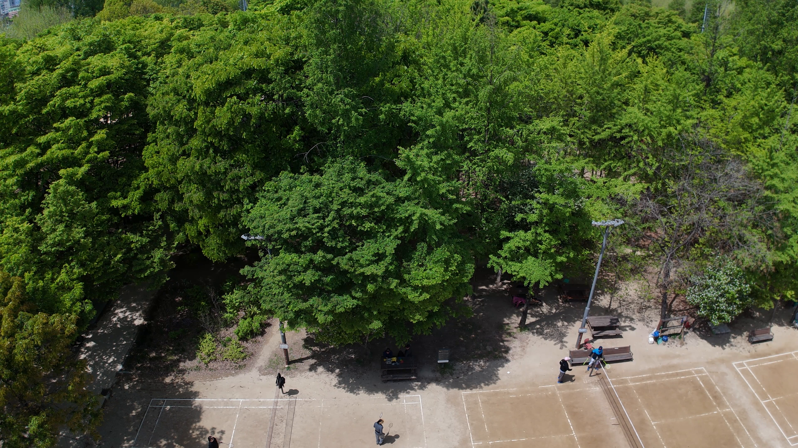
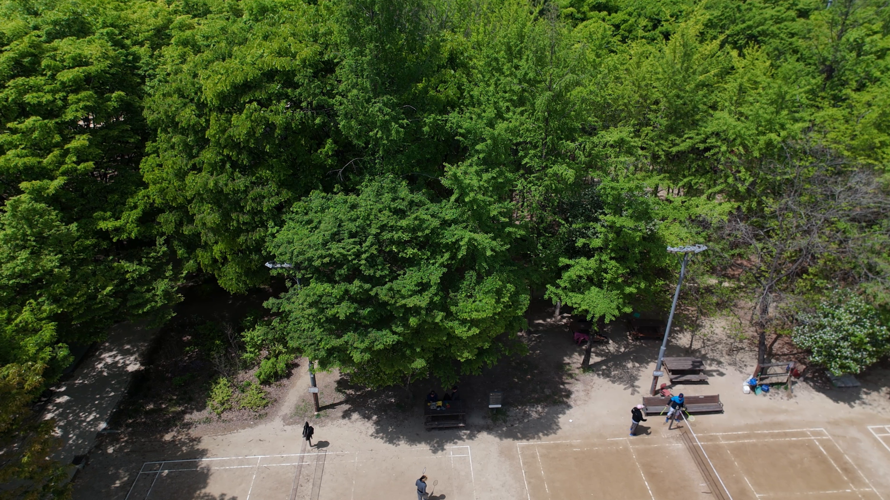
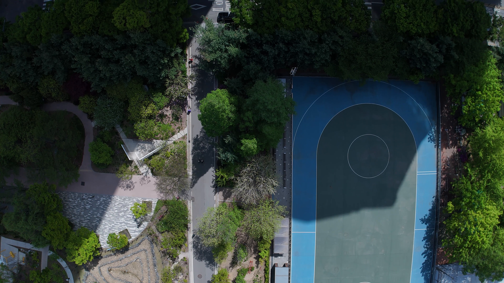
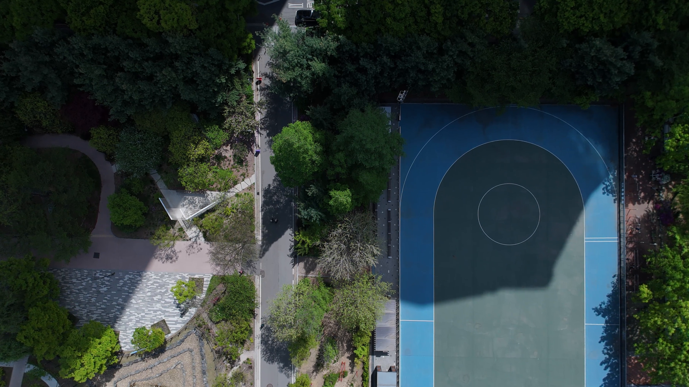

# Distortion Calibration

간단한 왜곡보정 함수 및 가이드라인

## 개요

광각랜즈가 부착된 카메라(DJI 드론 등) 렌즈의 방사/접선 왜곡을 보정하는 파이프라인입니다.
체커보드 캘리브레이션으로 왜곡 계수를 추출하고, 이를 이용해 이미지를 일괄 보정합니다.
캘리브레이션 해상도와 보정 대상 해상도가 다를 경우 내부 파라미터(fx/fy/cx/cy)를 자동 스케일링합니다.

## 주의점
- 체커보드 촬영 시 반드시 보정할 카메라로 촬영해야하며, 랜즈의 줌이나 포커스 등은 고정되어야합니다.
- 왜곡보정 결과물은 하나의 카메라에 종속적이며, 카메라가 바뀔경우 새로운 촬영이 필요합니다. 모델이 같더라도 다른 카메라일 경우 재촬영이 요구됩니다.
- 동일한 카메라에 대해 calibration을 수행한 후 calib_json을 저장하여 재사용할 수 있습니다. 
- 체커보드의 규격은 10x7 25mm 으로 기본 세팅되어있습니다. 다른 규격의 체커보드를 사용할 경우 DEFAULT_BOARD_SIZE 파라미터의 수정이 필요합니다. https://www.scribd.com/document/633020765/Checkerboard-A4-25mm-10x7-pdf


## 요구사항

```
python >= 3.8
opencv-python (cv2)
numpy
```

선택 (캘리브레이션 비디오 rotation 감지용):
```
ffprobe (ffmpeg)
```

## 사용법

### 준비물
- 프린트된 체커보드가 찍힌 사진(20장이상) 혹은 동영상. 
- 보정되어야할 이미지들


### 시나리오 1: 기존 캘리브레이션 JSON으로 바로 보정

```bash
python calibrate_undistort.py <input_dir> <output_dir> \
    --calib_json calib.json
```

### 시나리오 2: 체커보드 비디오로 캘리브레이션 후 보정

```bash
python calibrate_undistort.py <input_dir> <output_dir> \
    --calib_video data/calib.MP4 \
    --calib_json calib.json      # 결과 저장 경로 (선택)
```

### 시나리오 3: 체커보드 이미지 폴더로 캘리브레이션 후 보정

```bash
python calibrate_undistort.py <input_dir> <output_dir> \
    --calib_images data/checkerboard_frames/ \
    --calib_json calib.json
```

### 주요 인자

| 인자 | 기본값 | 설명 |
|------|--------|------|
| `input_dir` | (필수) | 왜곡 보정할 이미지 폴더 |
| `output_dir` | (필수) | 보정 이미지 저장 폴더 |
| `--calib_json` | None | 기존 캘리브레이션 JSON 경로 (있으면 즉시 사용, 없으면 캘리브레이션 후 저장) |
| `--calib_video` | None | 체커보드 캘리브레이션 비디오 파일 |
| `--calib_images` | None | 체커보드 캘리브레이션 이미지 폴더 |
| `--board_cols` | 10 | 체커보드 내부 코너 가로 수 |
| `--board_rows` | 7 | 체커보드 내부 코너 세로 수 |
| `--square_size` | 25.0 | 체커보드 정사각형 크기 (mm) |
| `--n_calib_frames` | 30 | 비디오를 N등분하여 추출할 프레임 수 |
| `--calib_fps` | None | FPS 기반 프레임 추출 (지정 시 n_calib_frames 대신 사용) |

## Before / After 예시

| Before (원본) | After (왜곡 보정) |
|:---:|:---:|
|  |  |
|  |  |

## 캘리브레이션 파라미터 JSON 형식

```json
{
  "fx": 2868.71,
  "fy": 2872.15,
  "cx": 2016.89,
  "cy": 1516.03,
  "k1": -0.00543,
  "k2": 0.01823,
  "p1": -0.00012,
  "p2": 0.00045,
  "k3": -0.01201,
  "rms": 0.3521,
  "image_width": 3840,
  "image_height": 2160
}
```

- `fx`, `fy`: 초점 거리 (px)
- `cx`, `cy`: 광학 중심 (px)
- `k1`, `k2`, `k3`: 방사 왜곡 계수
- `p1`, `p2`: 접선 왜곡 계수
- `rms`: 캘리브레이션 재투영 오차 (px, 1.0 미만 권장)

## 해상도 자동 스케일링

캘리브레이션 해상도와 보정 대상 해상도가 다를 경우:
- `fx`, `fy`, `cx`, `cy`는 비율에 맞게 자동 스케일링
- 왜곡 계수(`k1`, `k2`, `k3`, `p1`, `p2`)는 무차원이므로 변환 불필요
- 종횡비가 뒤집힌 경우(세로↔가로) 90도 회전 후 스케일링 자동 적용
